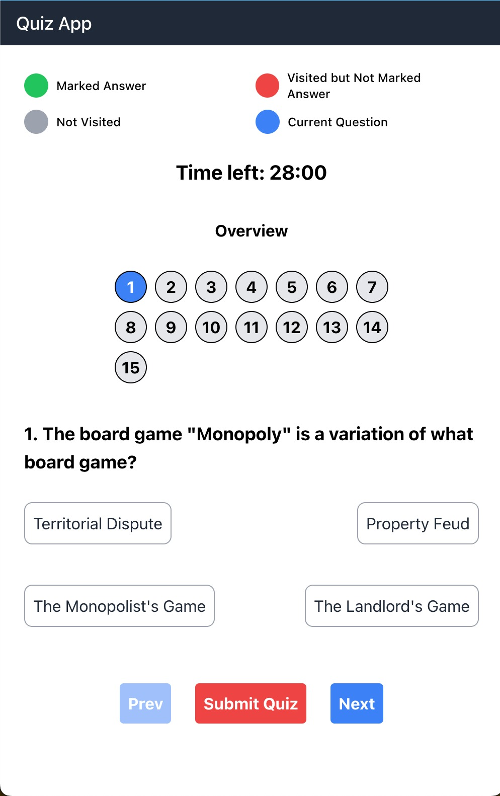

# Quiz App

## Overview
The Quiz App is a web application that allows users to take a quiz and see their progress. The application displays a list of questions, and the user can select a question to answer. The user can mark a question as answered, and the application will display the progress of the quiz. Users can use the next and prev buttons to reach other questions. Users can also directly click on overview buttons. The application is built using React and Tailwind CSS. 



The main components of the application are:

* App: The main component that contains the routs and components
* Quiz: The component that renders the questions and overview of all questions.
* Report: After the submission, this will display the report of the quiz.

This quiz application is made using the endpoint https://opentdb.com/api.php?amount=15 I have implemented `react-router` and `react-router-dom` to create routes.
I have also used `react-hot-toast` to set up the notifications on error. I have also used tailwind CSS to create my app and made it responsive to the mobile size. Also, added a loader while loading the questions. The logic behind my file structure is 

```
\src
    \components  ----> contains all the app-related components
    \layout      ----> contains layout-related components
    \pages       ----> contains components that are accessible using routes
    \utils       ----> contains extra files like constants or fetching data etc.
```

## Installation
To install the Quiz App, follow these steps:

* Clone the repository: git clone https://github.com/PriyaBihani/interview-task-josh-tech.git
* Install the dependencies: npm install
* Start the development server: npm start
* The application will be available at http://localhost:3000.

## Challenges Faced
* One of the challenges faced during the development of the Quiz App was displaying the answered/unanswered/not-visited in the overview. We overcame this challenge by using the visitedQuestions and attemptedQuestions state and passed them as props in Overview Components to mark the questions according to the specific color. And also provided a Guide for easier access.
* While loading the data from API, the user was showing NaN or undefined in the data, which I solved by adding a loader.
* In the reports page for a detailed overview I have also added a metrics section. In which unanswered questions metric was proving to be tricky, which I solved by correctly defining my initial values.
  
